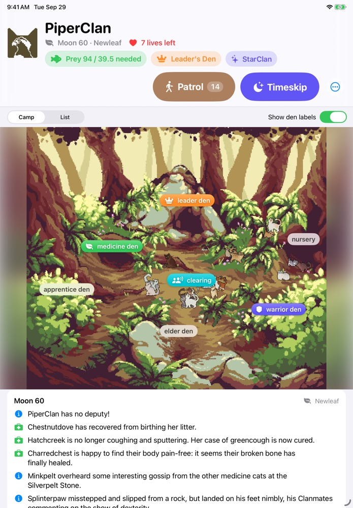
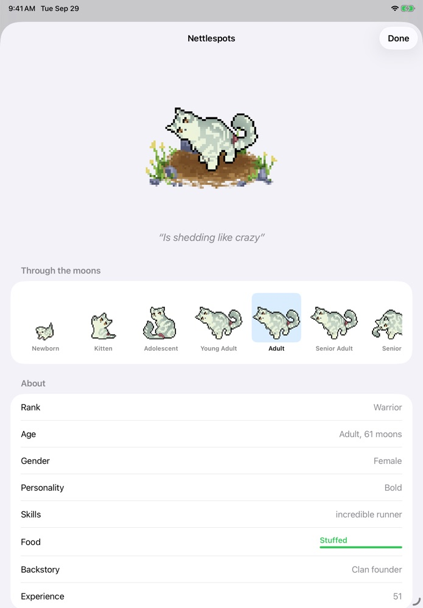
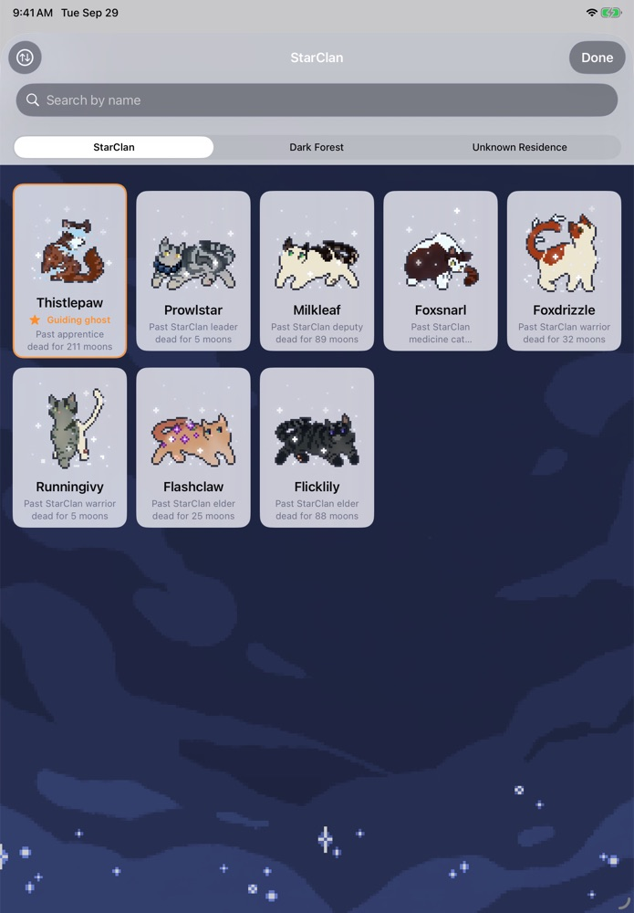
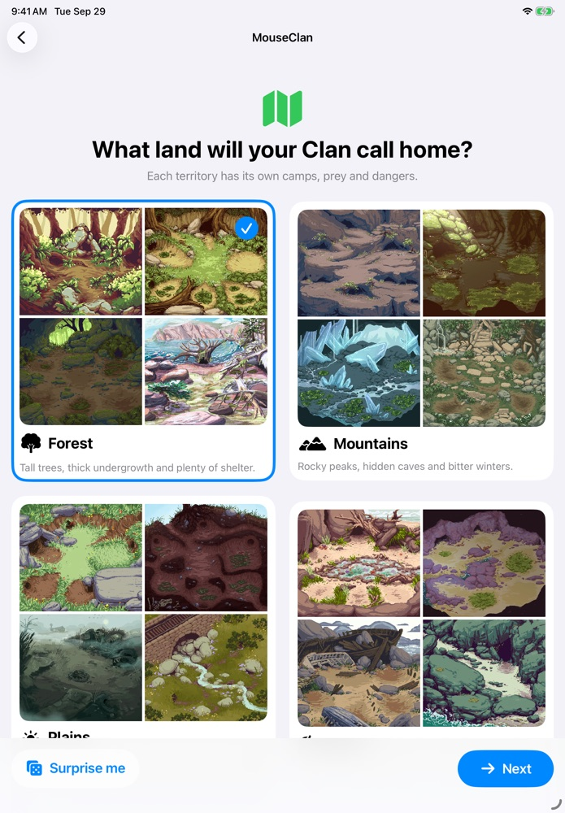
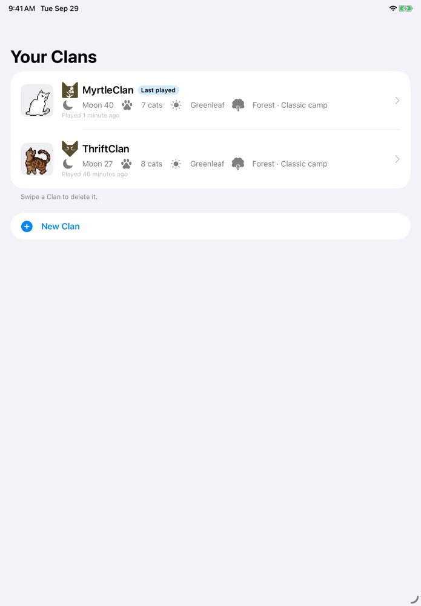

# KittyClan

A native iPad game about raising a Clan of forest cats, built in Swift and SwiftUI. KittyClan is a from-scratch port of [ClanGen](https://github.com/ClanGenOfficial/clangen). It reproduces ClanGen's simulation, events and pixel-art cats as closely as possible, and adds a touch interface.

<p align="center">
  
  
  
</p>
<p align="center">
  
  
</p>

## What's in the game

- **Founding:** choose the leader, deputy, medicine cat and members from generated cats, then pick a biome (forest, mountains, plains or beach), a camp and a Clan symbol.
- **Moons:** each timeskip ages the Clan and runs ClanGen's events: births, deaths, ceremonies, illness and injury, relationships and mates, new arrivals, war with neighbouring Clans, disasters (optional) and murder (optional).
- **Cats:** sprites are rendered pixel-for-pixel from ClanGen's sprite sheets. Each cat has a personality, skills, a backstory, thoughts, a gender identity and pronoun sets, conditions and a family tree.
- **The Clan:** patrols, the fresh-kill pile and herb stores, the leader's den, the warriors' den focus, mediation and allegiances.
- **The afterlife:** StarClan, the Dark Forest and the Unknown Residence, the Clan's guide, nine-lives ceremonies, fading, grief and the dead's thoughts.
- **Player controls:** change roles, mentors, mates and adoptive parents; rename cats; exile, kill or move dead cats between afterlives.
- **Saves:** several Clans can be saved side by side, and Clan Settings holds ClanGen's gameplay options.

## Requirements

- Xcode 27.1 or later (iPadOS 17+ deployment target, Swift 6)
- [XcodeGen](https://github.com/yonaskolb/XcodeGen): `brew install xcodegen`
- To regenerate game content: a checkout of ClanGen with its Python environment (for Pillow and pygame)

## Building

The Xcode project is generated from `project.yml` and isn't checked in.

```sh
xcodegen generate
open KittyClan.xcodeproj
```

Run the `KittyClan` scheme on an iPad or an iPad simulator. Command-line tests:

```sh
xcodebuild test -project KittyClan.xcodeproj -scheme KittyClan \
  -destination 'platform=iOS Simulator,name=iPad Air 11-inch (M4)'
```

## Game content

Sprites, text, camp art and other data are exported from a ClanGen checkout into `KittyClan/Resources` by `tools/export_assets.py`, and the results are committed. Re-run it after changing the exporter or updating ClanGen:

```sh
/path/to/clangen/.venv/bin/python tools/export_assets.py /path/to/clangen
```

See [docs/ARCHITECTURE.md](docs/ARCHITECTURE.md) for how the code is organised and how content flows from ClanGen into the app.

## Installing on an iPad

- **TestFlight:** archive in Xcode (Product → Archive) and distribute to App Store Connect. TestFlight isn't available to Apple accounts under 13.
- **Ad hoc:** register the iPad's UDID in the Apple Developer portal, then distribute the archive with **Release Testing** and install the `.ipa` by dragging it onto the iPad in Finder. Developer Mode must be on (Settings → Privacy & Security → Developer Mode).

## Debug launch arguments

Debug builds read launch arguments to jump straight to a state, e.g. `-autofound new -biome beach -timeskips 40 -showCat leader`. They are read in `AppModel` (search for `UserDefaults.standard`).

## Credits and licence

KittyClan is based on ClanGen by the ClanGen team.

- Code is licensed under the Mozilla Public License 2.0.
- Cat sprites, camp art, symbols and other art come from ClanGen and are licensed under [CC BY-NC 4.0](https://creativecommons.org/licenses/by-nc/4.0/). KittyClan must not be sold or used commercially.
- ClanGen's music (composed by Sharon Hurvitz and Carl-Isaak Krulewitch), ambience and sounds aren't in this repository, because their licence isn't stated. To include them in a local build, run `tools/add_audio.sh /path/to/clangen`, which converts them to AAC in `KittyClan/Resources/Audio` (git-ignored).

See [LICENSE.md](LICENSE.md).
